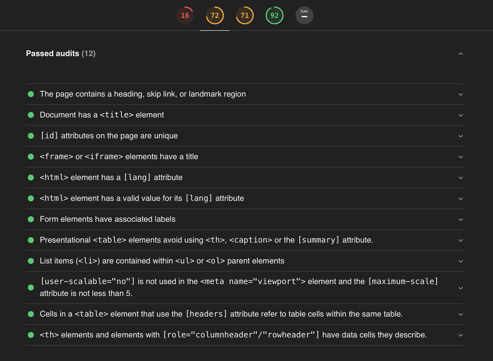

---

# Acessibilidade na interação humano-computador

 
*Autor*: **Erick Giffoni**
 

O que é acessibilidade ? Uma definição do [Dicionário Priberam](https://dicionario.priberam.org/)

Ok... e o que é acessível ?

Hmmmm... **e como isso se aplica na interação humano-computador ?**

> Percebe-se que **acessibilidade é uma qualidade**, ou seja, é um atributo, uma
característica do que é acessível, ou seja, daquilo a que se pode chegar.
Assim, **para IHC, acessibilidade está relacionado à facilidade de uso, à usabilidade
do site e à experiência de todo e de qualquer usuário**. O website, nesse contexto,
deve atender à um conjunto de princípios ou de normas para que **deficiências de visão,
ou de coordenação motora, ou de audição, ou qualquer outra não sejam um empecilho
para que o usuário consiga navegar no site.**

***

## Objetivos da avaliação de acessibilidade

- Pontuar os acertos do [Codeforces](http://codeforces.com/) em relação à acessibilidade ;

- Encontrar os pontos negativos (as falhas) do [Codeforces](http://codeforces.com/) em relação
à acessibilidade ;

- Consolidar os resultados encontrados para propor melhorias ao [Codeforces](http://codeforces.com/).

***

## Sobre a ferramenta **Google Lighthouse**

O Lighthouse é uma ferramenta automatizada de código aberto que aprimora a
qualidade de apps da Web. Ele pode ser executado como extensão do Chrome ou na
linha de comando. Basta informar ao Lighthouse a URL do site que você quer auditar
e a ferramenta executará uma série de testes na página. Ao final, um relatório
sobre o desempenho da página é gerado. Nesse relatório, você poderá usar os
testes que apresentaram falha como indicadores do que pode ser feito para aprimorar
o aplicativo.

(Adaptado de [Auditar apps da Web com o Lighthouse](https://developers.google.com/web/tools/lighthouse))

***

## Avaliação do Codeforces usando o Google Lighthouse

A avaliação do Google Lighthouse leva em conta outros aspectos, além da acessibilidade,
como :

- Performance
- Best Practices
- SEO ([Search Engine Optimization](https://resultadosdigitais.com.br/especiais/o-que-e-seo/))
- [Progressive Web App](https://developers.google.com/web/progressive-web-apps/checklist?utm_source=lighthouse&utm_medium=extension)

Para cada aspecto avaliado, a ferramenta em questão dá uma nota de 0 (zero) a 100 (cem),
sendo zero o pior valor e cem o melhor valor.

Com relação à acessibilidade, a imagem abaixo resume a avaliação feita pelo
Google Lighthouse para a página inicial do Codeforces, com uma nota igual a 72 (setenta e dois) :

***

A tabela a seguir reune os principais erros encontrados nessa avaliação :

|Categoria do erro|Descrição da categoria|Tipo do erro|Descrição do erro|Referência(s)|
|:------------:|--------------------------------------|:--------------------|:--------------------------------------|:------------:|
|Contrast|These are opportunities to improve the legibility of your content|Background and foreground colors do not have a sufficient contrast ratio|Low-contrast text is difficult or impossible for many users to read|[Learn more](https://web.dev/color-contrast/?utm_source=lighthouse&utm_medium=extension)|
|Names and labels|These are opportunities to improve the semantics of the controls in your application. This may enhance the experience for users of assistive technology, like a screen reader|Image elements do not have [alt] attributes|Informative elements should aim for short, descriptive alternate text. Decorative elements can be ignored with an empty alt attribute|[Learn more](https://web.dev/image-alt/?utm_source=lighthouse&utm_medium=extension)|
|Names and labels|These are opportunities to improve the semantics of the controls in your application. This may enhance the experience for users of assistive technology, like a screen reader|Links do not have a discernible name|Link text (and alternate text for images, when used as links) that is discernible, unique, and focusable improves the navigation experience for screen reader users|[Learn more](https://web.dev/link-name/?utm_source=lighthouse&utm_medium=extension)|
|Tables and lists|These are opportunities to to improve the experience of reading tabular or list data using assistive technology, like a screen reader|Lists do not contain only `<li>` elements and script supporting elements (`<script>` and `<template>`)|Screen readers have a specific way of announcing lists. Ensuring proper list structure aids screen reader output|[Learn more](https://web.dev/list/?utm_source=lighthouse&utm_medium=extension)|

***

**Clique [aqui](./codeforces_lighthouse.html) para visualizar a avaliação completa pelo [Google Lighthouse](#referencias) [1]**

***

## Referências

[1] [Google Lighthouse](https://developers.google.com/web/tools/lighthouse)

***

## Versionamento de edições desta página
| Data | Autor | Descrição | Versão |
|------|-------|-----------|--------|
| 16/11/2019 | Erick Giffoni | Criação da página Adição das referências Adição da avaliação em html pelo Google Lighthouse| 0.1 |
| 16/11/2019 | Erick Giffoni | Adição dos objetivos da avaliação de acessibilidade | 0.2 |
| 17/11/2019 | Erick Giffoni | Adição da descrição sobre a ferramenta Google Lighthouse | 0.2.1 |
| 24/11/2019 | Erick Giffoni | Criação da tabela com os principais erros encontrados nessa avaliação | 1.0 |
