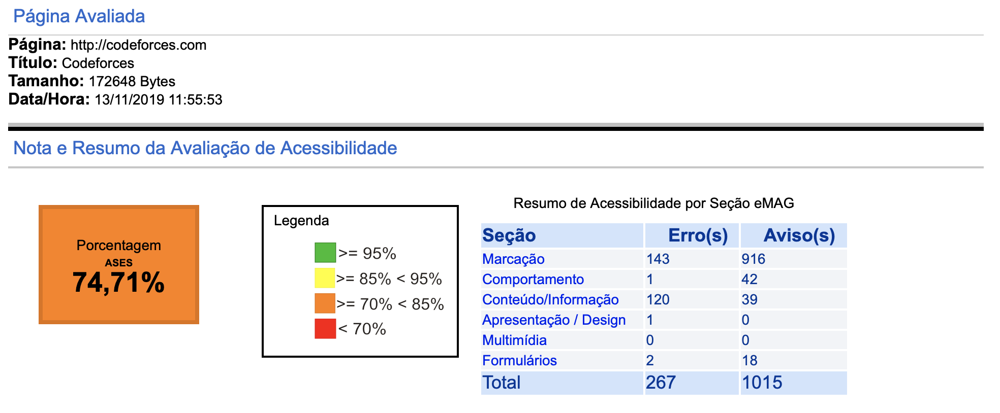

---

# Acessibilidade na interação humano-computador

 

*Autor*: **Erick Giffoni**
 

O que é acessibilidade ? Uma definição do [Dicionário Priberam](https://dicionario.priberam.org/)

Ok... e o que é acessível ?

Hmmmm... **e como isso se aplica na interação humano-computador ?**

> Percebe-se que **acessibilidade é uma qualidade**, ou seja, é um atributo, uma
> característica do que é acessível, ou seja, daquilo a que se pode chegar.
> Assim, **para IHC, acessibilidade está relacionado à facilidade de uso, à usabilidade
> do site e à experiência de todo e de qualquer usuário**. O website, nesse contexto,
> deve atender à um conjunto de princípios ou de normas para que **deficiências de visão,
> ou de coordenação motora, ou de audição, ou qualquer outra não sejam um empecilho
> para que o usuário consiga navegar no site.**

---

## Objetivos da avaliação de acessibilidade

- Pontuar os acertos do [Codeforces](http://codeforces.com/) em relação à acessibilidade ;

- Encontrar os pontos negativos (as falhas) do [Codeforces](http://codeforces.com/) em relação
  à acessibilidade ;

- Consolidar os resultados encontrados para propor melhorias ao [Codeforces](http://codeforces.com/).

---

## Sobre o padrão **eMAG**

> **O Modelo de Acessibilidade em Governo Eletrônico (eMAG) consiste em um
> conjunto de recomendações a ser considerado para que o processo de acessibilidade
> dos sítios e portais do governo brasileiro seja conduzido de forma padronizada e
> de fácil implementação.**

_Adaptado de_ [[2]](#ref2)

Na última década, a expansão prodigiosa da Internet vem revolucionando as formas
de comunicação, de acesso à informação e de realização de negócios em todo o mundo.
Mas a que se deve este fenômeno? Basicamente, deve-se ao seu potencial para atingir
instantaneamente um grande número de pessoas, independentemente de localização
geográfica e de contexto sócio-cultural.

Neste contexto, **a inacessibilidade de sítios eletrônicos** exclui uma parcela
significativa da população brasileira do acesso às informações veiculadas na internet.
O governo brasileiro - tendo em vista suas atribuições - não pode aceitar tal
situação na entrega de informações e serviços sob sua responsabilidade.

> **O Modelo de Acessibilidade em Governo Eletrônico (eMAG) tem o compromisso de ser
> o norteador no desenvolvimento e a adaptação de conteúdos digitais do governo federal,
> garantindo o acesso a todos.**

> **As recomendações do eMAG permitem que a implementação da acessibilidade digital
> seja conduzida de forma padronizada, de fácil implementação, coerente com as
> necessidades brasileiras e em conformidade com os padrões internacionais.**

É importante ressaltar que **o eMAG trata de uma versão especializada do documento
internacional WCAG (Web Content Accessibility Guidelines: Recomendações de Acessibilidade
para Conteúdo Web)** voltado para o governo brasileiro, porém o eMAG não exclui
qualquer boa prática de acessibilidade do WCAG.

_Adaptado de_ [[1]](#ref1)

---

## Avaliação do Codeforces usando a ferramenta **ASES** [[5]](http://asesweb.governoeletronico.gov.br/ases/)

A tabela a seguir apresenta os erros encontrados na página inicial do [Codeforces](http://codeforces.com/)
e serve como relatório de investigação para propor as melhorias :

| Recomendações do eMAG | Tipo do erro                                                                                                                                                                                                                                                                                                                                                                                                 | Quantidade de ocorrências                     |
| :-------------------: | :----------------------------------------------------------------------------------------------------------------------------------------------------------------------------------------------------------------------------------------------------------------------------------------------------------------------------------------------------------------------------------------------------------- | --------------------------------------------- |
|       Marcação        | - [1.1 Respeitar os Padrões Web](http://emag.governoeletronico.gov.br/#r1.1) - [1.2 Organizar o código HTML de forma lógica e semântica](http://emag.governoeletronico.gov.br/#r1.2) - [1.3 Utilizar corretamente os níveis de cabeçalho](http://emag.governoeletronico.gov.br/#r1.3) - [1.5 Fornecer âncoras para ir direto a um bloco de conteúdo](http://emag.governoeletronico.gov.br/#r1.5) | - 140 - 1 - 1 - 1 Total = 143 |
|     Comportamento     | - [2.2 Garantir que os objetos programáveis sejam acessíveis](http://emag.governoeletronico.gov.br/#r2.2)                                                                                                                                                                                                                                                                                                    | - 1 Total = 1                             |
|  Conteúdo/Informação  | - [3.5 Descrever links clara e sucintamente](http://emag.governoeletronico.gov.br/#r3.5) - [3.6 Fornecer alternativa em texto para as imagens do sítio](http://emag.governoeletronico.gov.br/#r3.6) - [3.10 Associar células de dados às células de cabeçalho](http://emag.governoeletronico.gov.br/#r3.10)                                                                                          | - 4 - 111 - 5 Total = 120         |
|  Apresentação/Design  | - [4.4 Possibilitar que o elemento com foco seja visualmente evidente](http://emag.governoeletronico.gov.br/#r4.4)                                                                                                                                                                                                                                                                                           | - 1 Total = 1                             |
|      Formulários      | - [6.2 Associar etiquetas aos seus campos](http://emag.governoeletronico.gov.br/#r6.2)                                                                                                                                                                                                                                                                                                                       | - 2 Total = 2                             |

---

**Clique [aqui](./avaliacao-emag-pdf.pdf) para ver a avaliação completa.**

---

## Referências

[1] [eMAG - Modelo de Acessibilidade em Governo Eletrônico](http://emag.governoeletronico.gov.br)

[2] [Modelo de Acessibilidade (eMAG)](https://www.governodigital.gov.br/transformacao/cidadania/acessibilidade/emag-modelo-de-acessibilidade-em-governo-eletronico)

[3] [e-MAG - Governo Digital](https://www.governodigital.gov.br/documentos-e-arquivos/e-MAG%20V3.pdf) [PDF]

[4] [eMAG Desenvolvedor](https://repositorio.enap.gov.br/bitstream/1/2710/3/Modulo_2_Web_Acessivel_desenvolvedor.pdf) [PDF]

[5] [ASES - Avaliador e Simulador de Acessibilidade em Sítios](http://asesweb.governoeletronico.gov.br/ases/)

[6] [Dicionário Priberam](https://dicionario.priberam.org/)

---

## Versionamento de edições desta página

| Data       | Autor         | Descrição                                           | Versão |
| ---------- | ------------- | --------------------------------------------------- | ------ |
| 13/11/2019 | Erick Giffoni | Criação da página e adição das referências          | 0.1    |
| 13/11/2019 | Erick Giffoni | Adição da avaliação inicial                         | 0.2    |
| 16/11/2019 | Erick Giffoni | Adição dos objetivos da avaliação de acessibilidade | 0.3    |
| 16/11/2019 | Erick Giffoni | Finalização da avaliação em conformidade eMAG       | 1.0    |
