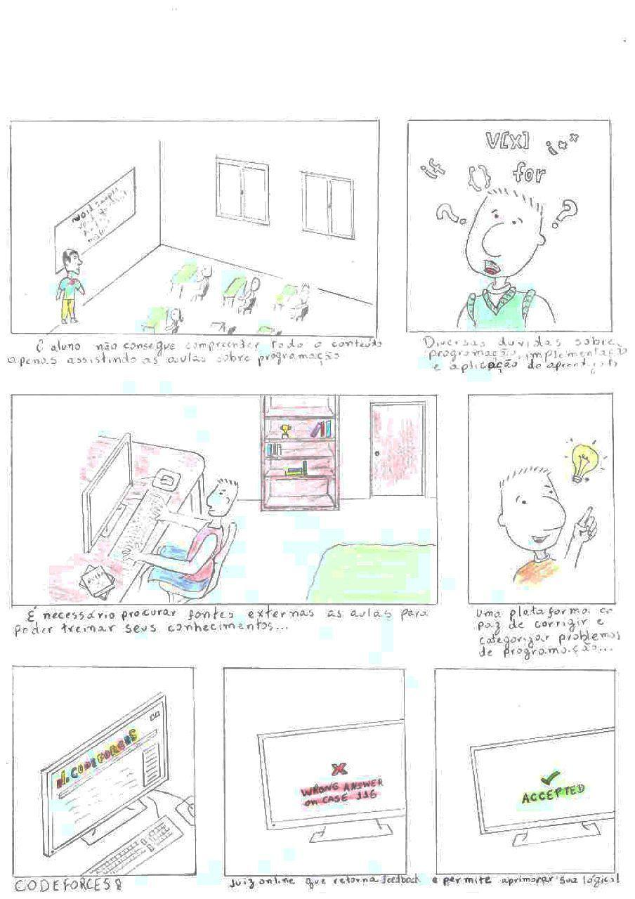

***
# Codeforces

## Storyboard
 Storyboard é uma ferramenta que pode ajudar os desenvolvedores a entender rapidamente o trabalho que precisa ser concluído. O Storyboard fornece transparência ao proprietário do produto e também ajuda a equipe na visualização de sequência e interconectividade das histórias de usuários.
## Storyboard Versão 0.1
> Autor: Todos os integrantes do grupo 

## Storyboard Versão 0.2
Novo storyboard realizado com base na refatoração sugerida pelo professor, ressaltando a satisfação do usuário.
> Autor: Bruno Duarte 

## Storyboard Versão 0.3 - Versão Final
Versão digital e personalizada do StoryBoard.

Autor: Bruno Duarte 

## Referências
> Design Based on Doug Funnie Animation

> Lindgaard, G., Dillon, R., Trbovich, P., White, R., Fernandes, G., Lundahl, S., Pinnamaneni, A.: User needs analysis and requirements engineering: Theory and practice. Interact. Comput. 18(1), 47–70 (2006)
CrossRefGoogle Scholar

> Haesen, M., Coninx, K., Van den Bergh, J., Luyten, K.: MuiCSer: A Process Framework for Multi-Disciplinary User-Centered Software Engineering processes. In: Proc. of Human-Centred Software Engineering, September 2008, pp. 150–165 (2008)
Google Scholar

> Brown, J., Lindgaard, G., Biddle, R.: Stories, Sketches, and Lists: Developers and Interaction Designers Interacting Through Artefacts. In: Proc. of Agile 2008, pp. 39–50 (2008)
Google Scholar

***
## Versionamento de edições desta página
| Data | Autor | Descrição | Versão |
|------|-------|-----------|--------|
| 04/10/2019 | Fernando Aguilar | Criação e edição inicial da página. | 0.1 |
| 07/10/2019 | Fernando Aguilar | Atualização da Imagem na página. | 0.2 |
|24/11/2019|Bruno Duarte|Adicionando versões do Storyboard|0.3|