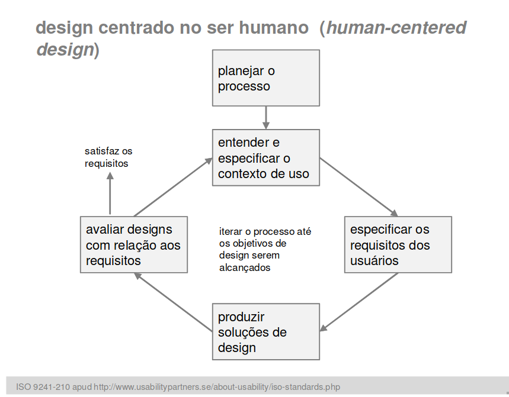

***

# Contexto de Uso

A avaliação em contexto de uso fornece dados de situações típicas de uso que não seriam percebidos em uma avaliação em laboratório.

Permite entender melhor como os usuários se apropriam da tecnologia no seu cotidiano e quais problemas podem ocorrer em situações reais de uso;

É difícil controlar sua execução para assegurar que certos aspectos do sistema sejam analisados.

O contexto de uso faz parte do processo de design focado no usuário, e é uma das etapas amsi umportantes para encontrar os problemas que estamos tentando solucionar.

[Avaliação Alexandre](avaliacao_alexandre.md)

## Versionamento de edições desta página

| Data | Autor | Descrição | Versão |
|------|-------|-----------|--------|
| 18/11/2019 | Fernando Aguilar | Created Page| 0.1 |