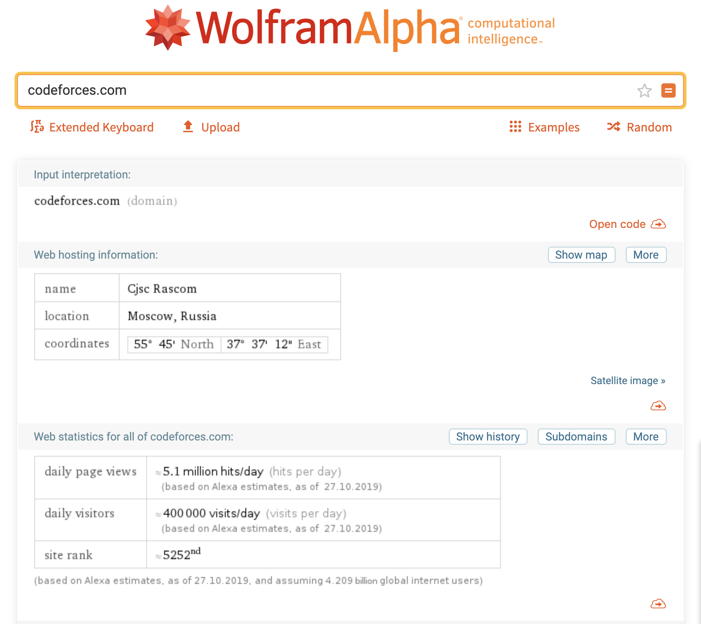

---

# Relato Final - Heuristicas

> Sobre os usuários:
> [vide descrição dos usuários](../../../contexto_de_uso/analise_de_usuario/#perfil-do-usuario-do-codeforces);
> Sobre o domínio:
> Site: [**codeforces.com**](http://codeforces.com)

## Estatísticas do site:

# Analise -

## Todas as Heuristicas Encontradas

| Qual diretriz foi violada ?                 | Em que local ?                      | Qual a gravidade do problema? | Justificativa de ser um problema                                                                                                                                                                                                                                                                                                                                                                                   | Frequência     | Impacto                                                                                                           | Persistência                                                        | Página avaliada                                  | Ideias de solucoes                                                                                                                                                                                        |
| ------------------------------------------- | ----------------------------------- | ----------------------------- | ------------------------------------------------------------------------------------------------------------------------------------------------------------------------------------------------------------------------------------------------------------------------------------------------------------------------------------------------------------------------------------------------------------------ | -------------- | ----------------------------------------------------------------------------------------------------------------- | ------------------------------------------------------------------- | ------------------------------------------------ | --------------------------------------------------------------------------------------------------------------------------------------------------------------------------------------------------------- |
| Ajuda e Documentação                        | Na aba de ajuda                     | Grave                         | **Contexto:** Usuários que desejam adicionar amigos em sua conta.  **Causa:** Ao tentar adicionar amizade com outros perfis no sistema é necessário seguir um caminho pouco intuitivo e a aba de ajuda não fornece um tutorial ou suporte a essa dúvida                                                                                                                                                        | Problema Comum | O usuário consegue superar o problema com dificuldade tendo que recorrer a fontes externas                        | Presente em todo o site                                             | Na categoria Help                                | O sistema pode se adequar e entregar mais resoluções as dúvidas em relação a plataforma na aba de ajuda.                                                                                                  |
| Prevenção de Erros                          | Em todo o site                      | Simples                       | **Contexto:** O sistema sempre tenta retornar um feedback de erros ao usuário. Exemplificando, durante a resolução de questões caso o usuário tentar submeter uma qustão e não está registrado no Contest. A plataforma alerta que o usuário deve estar registrado para prosseguir.   **Causa:** Para visualizar uma questão de um contest em andamento não é necessário estar registrado.                     | Problema Comum | O usuário consegue contornar esse problema com certa facilidade                                                   | A aba informativa está presente quando há algum equívoco do usuário | Na transição da página Problemas para Submissões | O feedback localiza-se em um pop-up no canto inferior, ou seja, não possui destaque. As dimensões do feedback podem ser ampliadas e um link de redirecionamento pode ser sugerido ao usuário.             |
| Compatibilidade do sistema com o mundo real | Em todo o site                      | Grave                         | **Contexto:** O modelo lógico do sistema não é compatível com a lógica do usuário. Determinadas funcionalidades(Editoriais, filtragens de conteúdo, adicionar amigos) do Codeforces não seguem um padrão ou raciocínio intuitivo aos usuários.   **Causa:** O usuário deve se adequar ao sistema e desenvolver-se na plataforma.                                                                               | Problema Comum | O usuário tem dificuldades para se superar/adequar ao problema                                                    | Presente em todo o site                                             | Todas                                            | Algumas funcionalidades importantes tais como editoriais e filtragens de questões merecem mais destaque seja atráves de um tutorial inicial ou priorizando funcionalidades em alguma sessão do Codeforces |
| Visibilidade do status do sistema           | na página Home, ao clicar pesquisar | Simples                       | **Contexto:** O sistema já possui uma barra azul indicando em qual página o usuário está, porém isso não é muito evidente.  **Causa:** Ao mudar de página, o sistema não apresenta algo que indique a mudança de página, a não ser a barra de carregamento horizontal do próprio navegador                                                                                                                     | Problema comum | O usuário consegue superar o problema com certa rapidez                                                           | Ocorre várias vezes                                                 | Home                                             | O sistema pode apresentar um círculo rodando para indicar o carregamento de uma nova página                                                                                                               |
| Controle e liberdade do usuário             | Em toda a interface do site         | Simples                       | **Contexto:** Navegação do usuário nas abas do site. **Causa:** O sistema não fornece ao usuário uma saída rápida para que ele volte à página anterior, a não ser pelo ícone "voltar" do próprio navegador.                                                                                                                                                                                                    | Problema comum | O usuário consegue superar o problema com certa rapidez                                                           | Ocorre várias vezes                                                 | Todas                                            | Adicionar uma seta no topo esquerdo de cada página para que o usuário possa voltar com mais facilidade                                                                                                    |
| Reconhecimento ao invés de memorização      | Em todo o site                      | Grave                         | **Contexto:** Usuários iniciantes navegando no site e ; usuários veteranos ao voltar a utilizar o site, depois de um longo tempo sem usá-lo. **Causa:** O site não é muito intuitivo em como realizar as ações disponíveis. Usuários iniciantes ficam confusos e usuários veteranos não se lembram de como utilizar o site                                                                                     | Problema comum | O problema é difícil de ser superado                                                                              | Ocorre várias vezes                                                 | Todas                                            | Mostrar, em cada ação/aba do site, uma interrogação. Esta, ao ser selecionada, abre um pop-up explicativo daquela funcionalidade                                                                          |
| Projeto estético e minimalista              | Em todo o site                      | Catastrófico                  | **Contexto:** O site apresenta muitas informações distribuídas em toda a tela. Inclusive, o tamanho dos textos e das caixas de texto é muito pequeno. **Causa:** Algumas informações apresentadas não têm tanta importância quanto outras e; usuários ficam desorientados ao utilizar o site                                                                                                                   | Problema comum | O usuário tem dificuldade em superar o problema                                                                   | Ocorre várias vezes                                                 | Todas                                            | - Aumentar o tamanho dos textos - Priorizar alguma informações e excluir outras - Implamntar um sistema de "preview" para os artigos/notícias/descrições de contests/etc                          |
| Prevenção de erros                          | na página de submissões             | Simples                       | **Contexto:** Na hora de submeter questões o sistema não tem nenhuma prenvenção de erro quanto a linguagem escolhida ou compilador.  **Causa:** O sistema só avisa que o erro occoreu depois que a questão foi enviada.                                                                                                                                                                                        | Problema comum | O usuário pode ser prejudicado por enviar uma questão errada perdendo pontos no contest.                          | Ocorre várias vezes                                                 | Submição de questão                              | O sistema pode apresentar um aviso de erro sempre que indentificar um arquivo com uma extensão diferente da do compilador selecionado.                                                                    |
| Controle e liberdade do usuário             | Em toda a interface do site         | Simples                       | **Contexto:** Navegação do usuário nas abas do site. **Causa:** O sistema não fornece ao usuário uma saída rápida para que ele volte à página anterior, a não ser pelo ícone "voltar" do próprio navegador.                                                                                                                                                                                                    | Problema comum | O usuário consegue superar o problema com certa rapidez                                                           | Ocorre várias vezes                                                 | Todas                                            | Acrescentar ícones nos botões de ação.                                                                                                                                                                    |
| Eficiência e flexibilidade de uso           | No site como um todo                | Grave                         | **Contexto:** O sistema não mantém o usuário sempre informado do status do sistema, ou seja, onde está, para onde vai, etc e isso não é eficiente e dificulta a flexibilidade de uso.   **Causa:** Se o usuário optar por outra atividade da barra de tarefas, não há um padrão para mudança de página, por exemplo, apenas um tracejado azul que tenta simular um feedback ao usuário, mas isso é ineficiente | Problema comum | O usuário apresenta dificuldade ao navegar pela plataforma e não consegue contornar esse problema com facilidade. | Ocorre com frequência                                               | Todas                                            | O sistema poderia apresentar um indicador para a visibilidade do sistema, mostrando o status do usuário na plataforma e uma descrição sobre o mesmo.                                                      |

### Rastreabilidade:

- [Resultados Erick e Fernando](erick_fernando.md)
- [Resultados Geise e Lorrany](geise_lorrany.md)
- [Resultados Bruno e Eugênio](bruno_eugenio.md)

---

# Conclusões

Numero de ocorrências das diretrizes violadas:

- Eficiência e flexibilidade de uso: 1
- Controle e liberdade do usuário: 2
- Prevenção de erros: 1
- Projeto estético e minimalista: 1
- Reconhecimento ao invés de memorização: 1
- Visibilidade do status do sistema: 1
- Compatibilidade do sistema com o mundo real: 1
- Ajuda e Documentação: 1
- Prevenção de Erros: 1

---

## Versionamento de edições desta página

| Data       | Autor            | Descrição    | Versão |
| ---------- | ---------------- | ------------ | ------ |
| 30/10/2019 | Fernando Aguilar | Created Page | 0.1    |
