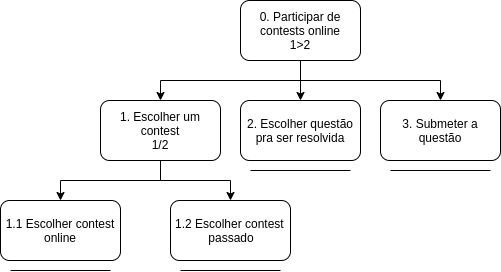

***
# Análise de Tarefas
> A análise de tarefas é a atividade que busca ter um etendimento sobre o trabalho dos usuário, como eles realizam este trabalho e o por quê. Nela nós visamos representar todos os métodos de coletar, classificar e interpretar dados que nos ajudem a a entender o desempenho de um sistema.

Em IHC a análise de tarefas é geralmente utilizada em três atividades habituais, são elas:

- Para a análise da situação atual. (Que pode ser apoiada ou não por um sistema computacional.)
- Para o (re)design de um sistema computacional.
- Para a avaliação do resultado de uma intervenção que inclua um novo sistema computacional.

Existem diversos métodos de análise de tarefas, no entanto os mais comuns, e que também serão utilizados neste trabalho são:

- Análise Hieráquica de tarefas (AHT)
- ConcurTaskTrees (CTT)

***
# Análise Hieráquica de tarefas (HTA)

## Objetivos dos Usuários

> Os **objetivos** são as ações que os usuários desejam excutar, estes são o nível mais alto da hierarquia de objetivos, quando um objetivo precisa executar mais de uma tarefa para ser finalizado, chamamos essas tarefas de **subobjetivos**. Já a relação entre um objetivo e seus subobjetivos são chamadas de **planos**, por fim, quando nós chegamos no nível mais baixo da hieraquia temos uma **operação** que é quando atingimos um objetivo ou subobjetivo.

Através da análise de usuários que foi feita pelo grupo, e de uma análise da plataforma, foi possível definir alguns dos objetivos dos usuários do **CodeForces**, são eles:

**1 - Resolver problemas de programação competitiva**

- Figura 1. Diagrama AHT para o objetivo “Resolver problemas de programação competitiva"

| Objetivos/Operações | Problemas e Recomendações |
|------|-------|
| 0. Resolver um problema 1>2 | **input:** Resolver um problema de programação competitiva no codeforces **feedback:** Novo problema aparece na sua lista de problemas resolvidos **plano:** Resolver um problema em uma determinada linguagem e submete-lo para receber um "accepted" **recomendação:** observar o status de submição para saber se o seu problema foi aceito |
| 1. Escolher um problema 1/2 | **plano:** Escolher um problema de programação competitiva no codeforces através da lista de problemas disponíveis ou através da dificuldade|
| 1.1 Escolher através da lista de problemas | |
| 1.2 Escolher através da dificuldade | |
| 3. Submeter um problema | **input:** Enviar o código de resolução da questão **feedback:** O sistema irá avisar se sua resposta foi "accepted", "wrong answer", "time limit exceed", "compilation error" ou "run time error" |

- Tabela 1. Tabela de representação de tarefas da AHT

**2 - Participar de contests**

- Figura 2. Diagrama AHT para o objetivo “Participar de contests"

**3 - Participar do fórum de discussões**

Outros
Rating
Contests no modelo ICPC
Grupos da universidade
API
HELP
Ver calendário de contests
Propor um contest/problema
visualizar seu perfil
editar perfil
ver pergutas que eu fiz no fórum
ver times que participei em contests
ver minhas submissões
encontrar um usuário
Talks - enviar mensagem para usuários
***
### Versionamento de edições desta página
| Data | Autor | Descrição | Versão |
|------|-------|-----------|--------|
| 08/10/2019 | Erick Giffoni | Criação inicial da página. | 0.1 |
| 10/10/2019 | Lorrany dos Santos Azevedo | Edição da página e adição de método AHT | 0.2 |
