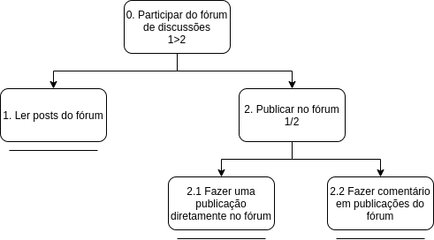

***
# Análise de Tarefas
> A análise de tarefas é a atividade que busca ter um etendimento sobre o trabalho dos usuário, como eles realizam este trabalho e o por quê. Nela nós visamos representar todos os métodos de coletar, classificar e interpretar dados que nos ajudem a a entender o desempenho de um sistema.

Em IHC a análise de tarefas é geralmente utilizada em três atividades habituais, são elas:

- Para a análise da situação atual. (Que pode ser apoiada ou não por um sistema computacional.)
- Para o (re)design de um sistema computacional.
- Para a avaliação do resultado de uma intervenção que inclua um novo sistema computacional.

Existem diversos métodos de análise de tarefas, no entanto os mais comuns, e que também serão utilizados neste trabalho são:

- Análise Hieráquica de tarefas (AHT)
- GOMS (Goals, Operators, Methods and Selection Rules)

***
## Análise Hieráquica de tarefas (AHT)

 A análise hierárquica de tarefas foi desenvolvida em 1960 com o objetivo de entender as competências envolvidas nas tarefas do usuário, esta avalia primeiro os objetivos de alto nível dos usuários, decompodo-os em subobjetivos.

### Objetivos dos Usuários

 > Os **objetivos** são as ações que os usuários desejam excutar, estes são o nível mais alto da hierarquia de objetivos, quando um objetivo precisa executar mais de uma tarefa para ser finalizado, chamamos essas tarefas de **subobjetivos**. Já a relação entre um objetivo e seus subobjetivos são chamadas de **planos**, por fim, quando nós chegamos no nível mais baixo da hieraquia temos uma **operação** que é quando atingimos um objetivo ou subobjetivo.

Através da análise de usuários que foi feita pelo grupo, e de uma análise da plataforma, foi possível definir alguns dos objetivos dos usuários do **CodeForces** e fazer uma análise hierárquica, são eles:
***

**1 - Resolver problemas de programação competitiva**

- Figura 1. Diagrama AHT para o objetivo “Resolver problemas de programação competitiva"

| Objetivos/Operações | Problemas e Recomendações |
|------|-------|
| 0. Resolver um problema 1>2 | **input:** Resolver um problema de programação competitiva no codeforces **feedback:** Novo problema aparece na sua lista de problemas resolvidos **plano:** Resolver um problema em uma determinada linguagem e submete-lo para receber um "accepted" **recomendação:** observar o status de submição para saber se o seu problema foi aceito |
| 1. Escolher um problema 1/2 | **plano:** Escolher um problema de programação competitiva no codeforces através da lista de problemas disponíveis ou através da dificuldade|
| 1.1 Escolher através da lista de problemas | |
| 1.2 Escolher através da dificuldade | |
| 3. Submeter um problema | **input:** Enviar o código de resolução da questão **feedback:** O sistema irá avisar se sua resposta foi "accepted", "wrong answer", "time limit exceed", "compilation error" ou "run time error" |

- Tabela 1. Tabela de representação de tarefas da AHT do obejetivo "Resolver problemas" 

***

**2 - Participar de contests**

- Figura 2. Diagrama AHT para o objetivo “Participar de contests"

| Objetivos/Operações | Problemas e Recomendações |
|------|-------|
| 0. Participar de contests 1>2 |**plano:** Participar de um contest e resolver os problemas  |
| 1. Escolher um contest 1/2 | **plano:** Escolher um contest que pode ser ao vivo ou não|
| 1.1 Escolher contest online | |
| 1.2 Escolher contest passado | |
| 2. Escolher questão que será resolvida | **plano:** Escolher uma das questões disponíveis no contest e resolve-la|**recomendação:** Ler todas as questões antes de resolver, e olhar sempre o score praver qual questão foi submetida primeiro|
| 3. Submeter um problema | **input:** Enviar o código de resolução da questão **feedback:** O sistema irá avisar se sua resposta foi "accepted", "wrong answer", "time limit exceed", "compilation error" ou "run time error" |

- Tabela 2. Tabela de representação de tarefas da AHT do obejetivo "Participar de contests"

***

**3 - Participar do fórum de discussões**

- Figura 3. Diagrama AHT para o objetivo “Participar do fórum de discussões"

| Objetivos/Operações | Problemas e Recomendações |
|------|-------|
| 0. Participar do fórum de discussões 1>2 |**plano:** Publicar no fórum, ver publicações de outros usuários, fazer comentários  |
| 1. Ler posts do fórum | |
| 2. Publicar no fórum | **input:** Fazer publicações que podem ser dúvidas, avisos e etc. **feedback:** Ser notificado caso alguém responda um cometário ou comente e uma publicação sua. **plano:** Escrever um texto e depois publicá-lo. |
| 2.1 Fazer publcação diretamente no fórum | |
| 2.2 Fazer um comentário| |

- Tabela 3. Tabela de representação de tarefas da AHT do obejetivo "Participar do fórum"

***
## Análise GOMS (Goals, Operators,Methods and Selection Rules)
O método Goms tem o objetivo de analisar o desempenho de usuários realizando tarefas dentro de um sistema computacional, o modelo GOMS tem se tornado eficiente para prever o desempenho, ou seja, predizer o impacto de decisões de design no desempenho de um sistema computacional.

* **Objetivos:** Apresentam o que o usuário quer realizar utilizando o software.
* **Operadores:** Primitivas internas (congnitivas), ou externas (ações que o usuário consegue realizar com o software)
* **Métodos:** Sequências de subobjetivos e operadores que permitem atigir um objetivo.
* **Regras de Seleção:** Tomada de decisões do usuário sobre qual método usar para se atingir um objetivo.

[comment]: <> (**4 - Debugar um problema**)

***

[comment]: <> (**5 - Editar Perfil**)

**5 - Ver minhas submissões**

***
**7 - Encontrar um usuário**
***
**8 - Buscar por ajuda no site**
***
**9 - Ver calendário de contests**
***
**10 - Ver Ranking**
***
**11 - Utilizar a API do CodeForces**
***
**12 - Propor um contest/problema**
***
Outros: Contests no modelo ICPC
Grupos da universidade
visualizar seu perfil
ver pergutas que eu fiz no fórum
ver times que participei em contests
Talks - enviar mensagem para usuários

***
### Versionamento de edições desta página
| Data | Autor | Descrição | Versão |
|------|-------|-----------|--------|
| 08/10/2019 | Erick Giffoni | Criação inicial da página. | 0.1 |
| 10/10/2019 | Lorrany dos Santos Azevedo | Edição da página e adição de método AHT | 0.2 |
