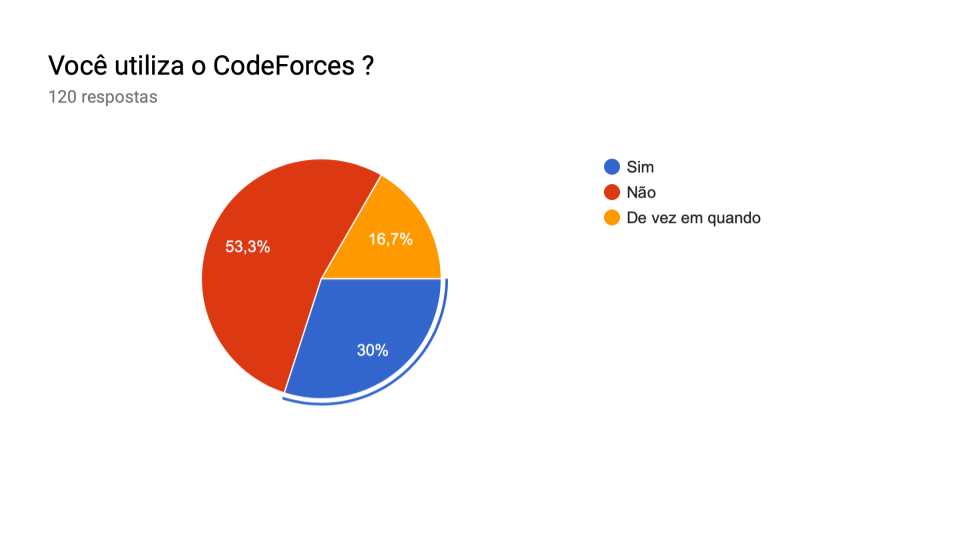
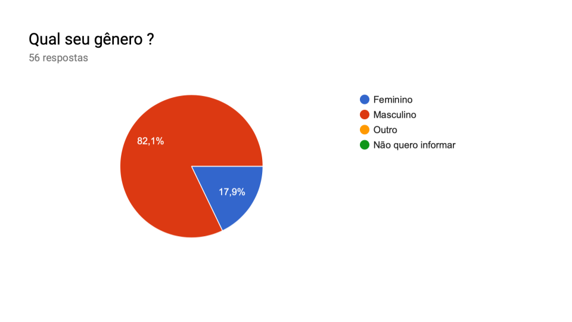
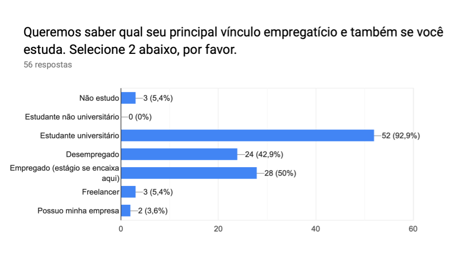
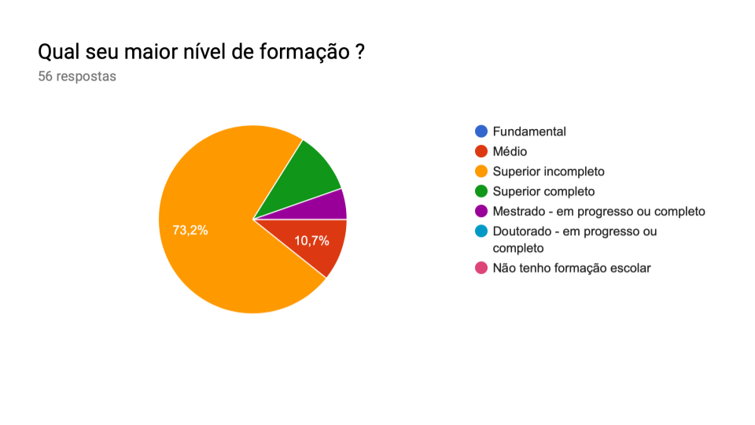
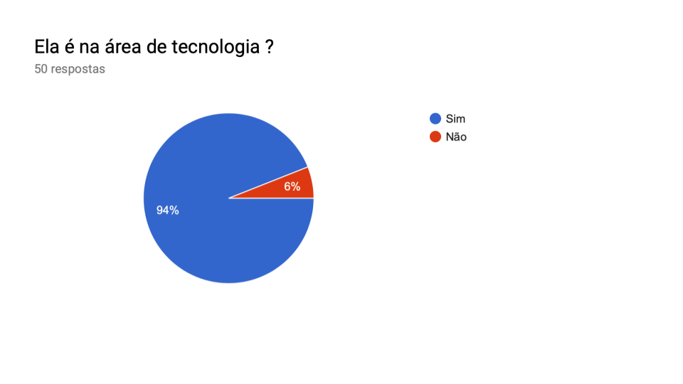
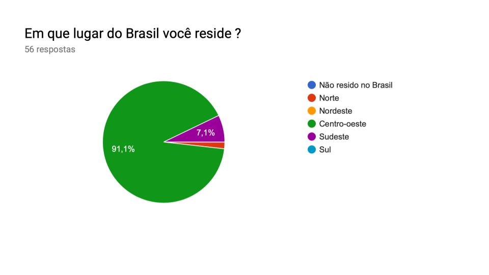
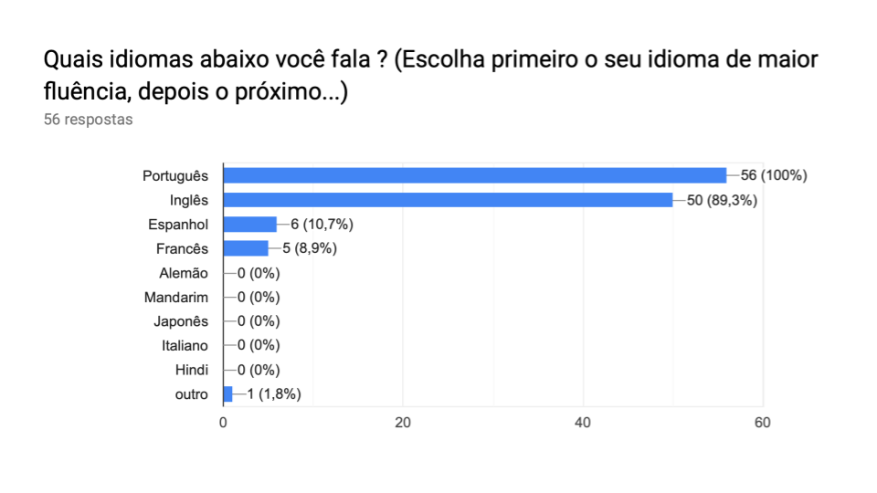
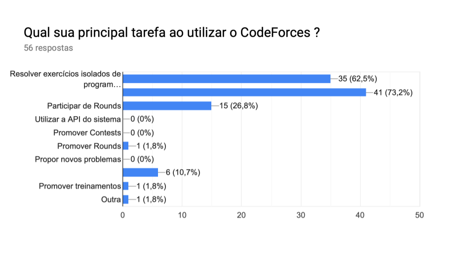
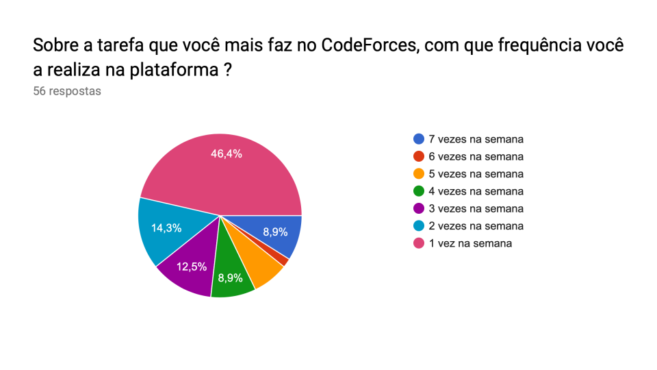

***
# Análise de usuário
> Ao trabalhar com **engenharia de software**, seja para construir, para manter ou 
para evoluir um sistema, é muito importante saber responder, de maneira objetiva, 
à pergunta : **"Quem é o usuário desse software?"**.

Por muitas vezes, a resposta para esse questionamento pode não ser muito trivial 
de se obter. Outras vezes, ela pode ser tão trivial que, na verdade, não fornece 
informações boas e objetivas sobre o usuário.

A ideia da análise de usuário é **buscar o máximo de informações relevantes sobre 
o usuário de um sistema**, de maneira clara e objetiva, a fim de que a engenharia 
desse software seja efetiva e realmente voltada àquele tipo de usuário. Tais  
informações podem ser usadas nos processos de engenharia desde o levantamento de 
requisitos até à projeção da interface do sistema com o usuário, preocupando-se 
com a experiência dele no sistema.
***
# Demonstração de resultados da pesquisa
Existem diversas técnicas para analisar o **perfil de usuário** de um software. 
Com o objetivo de fazer um levantamento rápido das informações sobre o usuário  
do **CodeForces** e de ter um alcance razoável de pesquisa, além de poder coletar 
esses dados online, nossa equipe optou pela técnica dos **questionários**.

> As informações alvo do nosso trabalho não são muitas. Queremos saber alguns **dados 
demográficos** e também alguns dados em relação à **interação do usuário com a Plataforma**,
bem como sobre a relação dele com a internet.

Nesse sentido, um questionário foi concebido. A primeira pergunta, que é chave para 
restringirmos os entrevistados, é para sabermos se o respondente usa o CodeForces. 
Veja imagem abaixo :

#### 1. Você utiliza o CodeForces ?

Como é possível perceber, conseguimos alcançar 120 pessoas na pesquisa. Entretanto, 
53,3 % delas não utiliza a Plataforma. Os outros 46,7 % , que são os usuários em questão, 
passaram para as próximas perguntas do questionário, este dividido conforme abaixo:

- [Dados demográficos](#dados-demograficos);
- [Relação do usuário com a tecnologia](#relacao-do-usuario-com-a-tecnologia)

**Obs.:** O questionário foi feito em modelo interativo, no qual **as respostas do 
          usuário determinam se ele prossegue para a próxima pergunta ou não**. Por esse motivo, 
          algumas perguntas podem ter o número de respostas diferente de outras.

## Dados demográficos

#### 2. Qual sua idade ?

#### 3. Qual seu gênero ?

#### 4. Você é financeiramente...

#### 5. Queremos saber qual seu principal vínculo empregatício e também se você  estuda. Selecione 2 abaixo, por favor.

#### 6. Qual seu maior nível de formação ?

#### 7. Ela é na área de tecnologia ?

#### 8. Em que lugar do Brasil você reside ?

#### 9. Onde você reside ?
*Para usuários que selecionaram a opção "Não resido no Brasil", da pergunta anterior.*

Não obtivemos respostas.
#### 10. Quais idiomas abaixo você fala ? (Escolha primeiro o seu idioma de maior  fluência, depois o próximo...)

## Relação do usuário com a tecnologia

#### 11. Que atividade você MAIS faz online ?

#### 12. Qual sua principal tarefa ao utilizar o CodeForces ?

#### 13. Com que escala você utiliza o CodeForces em relação aos concorrentes dele?  (Uva, URI, CD-MOJ, outros)

#### 14. Sobre a tarefa que você mais faz no CodeForces, com que frequência você  a realiza na plataforma ?

***
# Perfil do usuário do CodeForces
em definição...

***
## Versionamento de edições desta página
| Data | Autor | Descrição | Versão |
|------|-------|-----------|--------|
| 08/10/2019 | Erick Giffoni | Criação e edição inicial da página. | 0.1 |
| 09/10/2019 | Erick Giffoni | Adição dos resultados da pesquisa | 0.2 |
