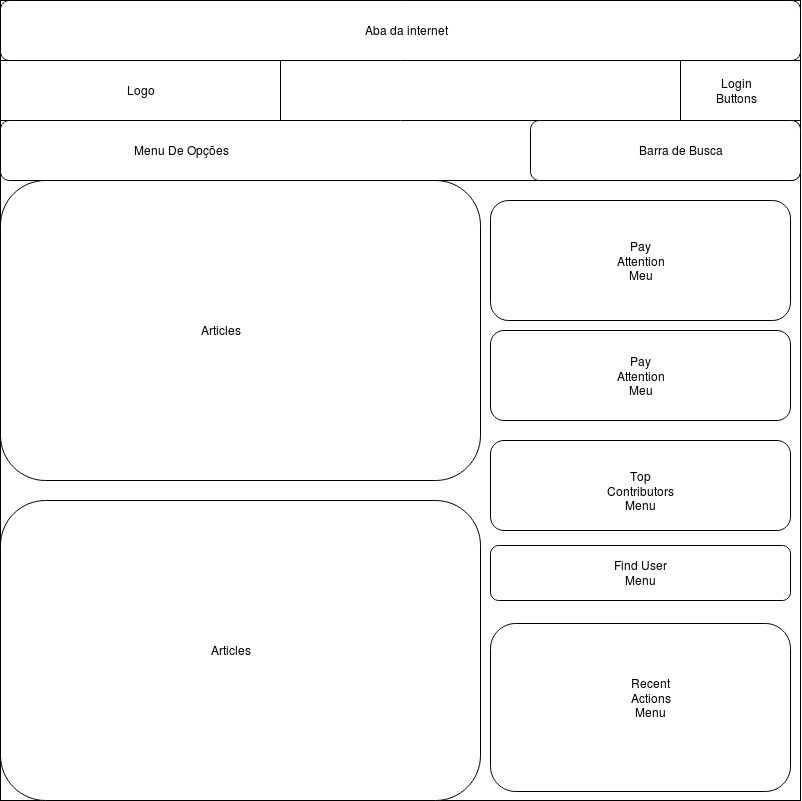
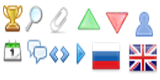
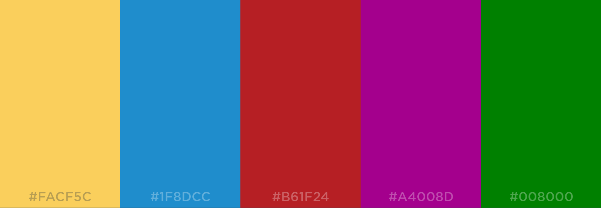

## 3.1 Disposição espacial e grid

## 3.2 Janelas

O layout deve seguir a seguinte proporção de acordo com o tamanho da tela, nesse caso da imagem acima, 800x800.

## 3.3 Tipografia

A fonte utilizada, tanto para títulos quanto para textos, são as fontes da Cuprum Regular da família verdana, arial, sans-serif; Com tamanho de 1.4rem;

## 3.4 Símbolos não tipográficos

Os símbolos utilizados para filtro de busca, chat, ícone da busca e entre outros, devem seguir o seguinte padrão de desenho:

## 3.5 Cores

O padrão de cores adotado deverá ser:

## 3.6 Animações

O website não possui animações visiveis.

---

## Versionamento de edições desta página

| Data       | Autor            | Descrição                            | Versão |
| ---------- | ---------------- | ------------------------------------ | ------ |
| 04/10/2019 | Fernando Aguilar | Criação e edição inicial da página.  | 0.1    |
| 04/10/2019 | Fernando Aguilar | Atualização dos elementos da página. | 0.2    |
